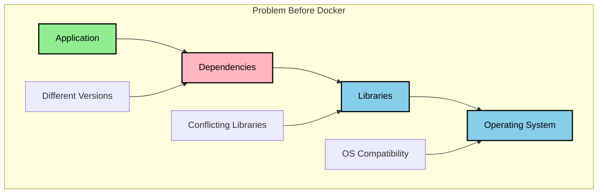
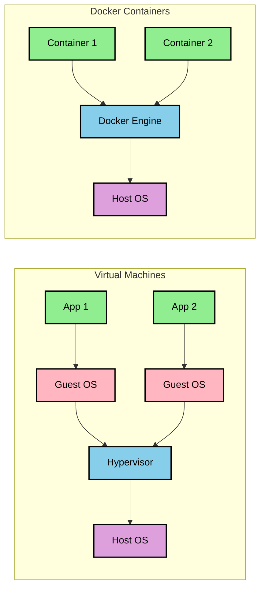
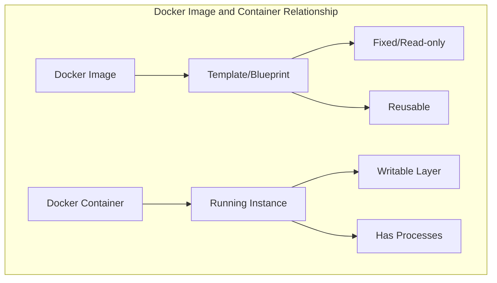

# Understanding Docker Fundamentals

## What Problem Does Docker Solve?



Before Docker, development teams faced these challenges:
1. Different developers had different OS versions ❌
2. Application needed specific versions of dependencies ❌
3. Setting up new developer environment took days ❌

Example:
- One service needs Python 2
- Another service needs Python 3
- One service needs MongoDB 4.0 
- Another needs MongoDB 5.0
- Result: Dependency conflicts! 😫

## How Docker Solves This



Docker solves this by using containers:
1. Each service runs in its own container 📦
2. Each container has its own dependencies 🔧
3. All developers just run one command: `docker run` ✅
4. Works the same way on every computer 🎯

## Key Difference from VMs

1. Virtual Machines:
   - Need full OS copy
   - Slow to start
   - Takes GB of space
   - Complete isolation

2. Docker Containers:
   - Share host OS
   - Start in seconds
   - Take MB of space
   - Lightweight isolation

## Real World Example
A team developing a web application:
- Web Server (Node.js)
- Database (MongoDB)
- Cache (Redis)

Without Docker: Configure each on your machine 😫
With Docker: Just run 3 commands! 😊
```
```

Here's the markdown content for your notes, with proper diagram formatting:


## Docker Images vs Containers



### Key Differences:

1. Docker Image:
   - Like a recipe or template
   - Read-only file
   - Used to create containers
   - Can be shared and reused

2. Docker Container:
   - Running instance of an image
   - Like a dish made from recipe
   - Has its own writable layer
   - Can be started, stopped, deleted

### Real-World Analogy:
- Image = Cookie Cutter
- Container = Actual Cookie

### Example:
```bash
# Pull an image
docker pull nginx

# Create multiple containers from same image
docker run nginx  # Container 1
docker run nginx  # Container 2
```


